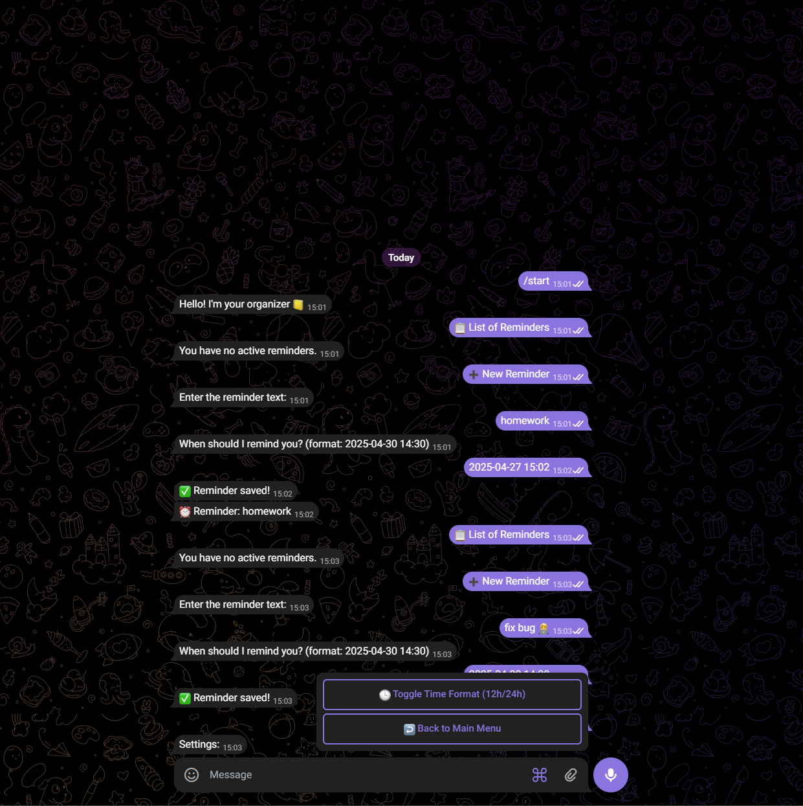
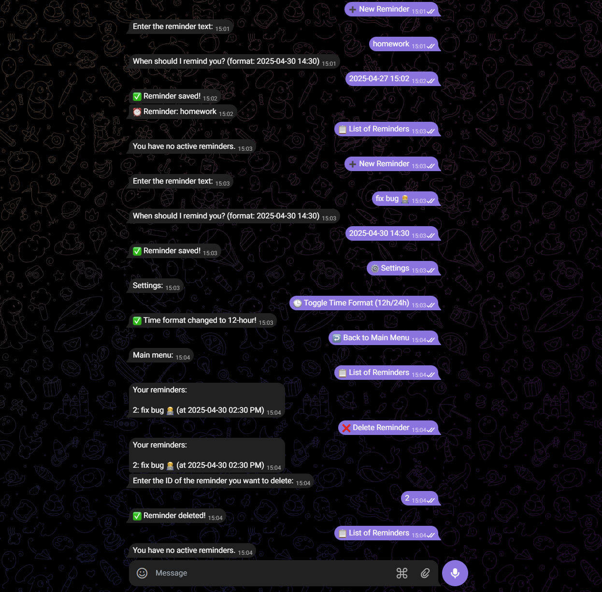
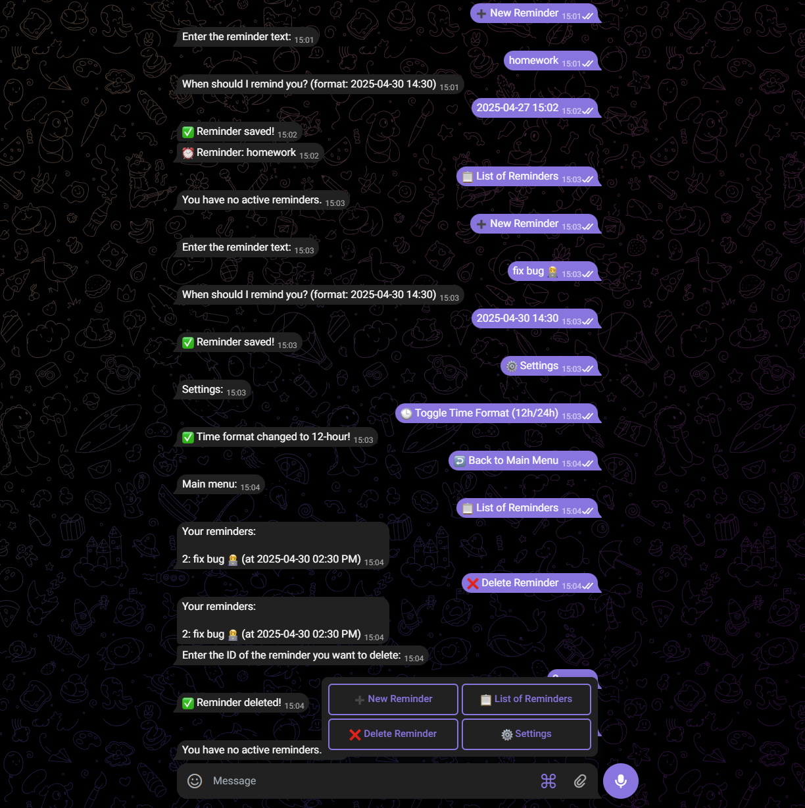

# Telegram Reminder Bot

A fully-functional reminder bot for Telegram that helps users manage and track their tasks with timely notifications. The bot features a Django backend API and a Telegram bot frontend.

## 🌟 Features

- ✅ **Create Reminders**: Easily set reminders with custom text and time
- 📋 **View Reminders**: List all your active reminders
- ❌ **Delete Reminders**: Remove reminders when no longer needed
- ⏰ **Automatic Notifications**: Receive timely alerts when reminders are due
- ⚙️ **Customizable Settings**: Toggle between 12-hour and 24-hour time formats

## 🏗️ Project Structure

The project is divided into two main components:

1. **Django Backend API**: Handles data storage, business logic, and reminder management
2. **Telegram Bot Client**: Provides the user interface and interaction via Telegram

## 🧩 Technical Stack

### Backend
- Django with Django REST Framework
- SQL Server
- Python dateutil for date parsing and manipulation

### Frontend
- Python-telegram-bot library
- Asynchronous request handling
- Conversation-based user interaction

## 🚀 Installation & Setup

### Prerequisites
- Python 3.8+
- Django 3.2+
- Telegram Bot Token (from BotFather)

### Environment Variables
Create a `.env` file with the following variables:
```
DB_NAME=
DB_HOST=
DB_PORT=
DB_USER=
DB_PASSWORD=
DB_DRIVER=
DB_TRUSTED_CONNECTION=

API_URL=
TELEGRAM_BOT_TOKEN=
SECRET_KEY=

CHECK_INTERVAL=
```

### Backend Setup
1. Clone the repository
```bash
git clone https://github.com/yourusername/telegram-reminder-bot.git
cd telegram-reminder-bot
```

2. Install dependencies
```bash
pip install -r requirements.txt
```

3. Run migrations
```bash
python manage.py migrate --fake
```

4. Start the Django server
```bash
python manage.py runserver
```

### Bot Setup
1. Run the Telegram bot
```bash
python bot.py
```

## 📱 Usage

1. Start a conversation with your bot on Telegram
2. Use the `/start` command to initialize the bot
3. Navigate through the menu options:
   - "➕ New Reminder" - Create a new reminder
   - "📋 List of Reminders" - View all active reminders
   - "❌ Delete Reminder" - Remove a reminder
   - "⚙ Settings" - Adjust your preferences

## 📷 Screenshots

<p align="center">
  <!--  -->
  <!--   -->
  
</p>

## 📊 API Endpoints

| Endpoint | Method | Description |
|----------|--------|-------------|
| `/register/` | POST | Register a new user |
| `/reminders/create/` | POST | Create a new reminder |
| `/reminders/{telegram_id}/` | GET | List all reminders for a user |
| `/reminders/{telegram_id}/{reminder_id}/delete/` | DELETE | Delete a specific reminder |
| `/toggle-time-format/{telegram_id}/` | POST | Toggle time format preference |
| `/reminders/mark-sent/{reminder_id}/` | POST | Mark a reminder as sent |
| `/reminders/due/{telegram_id}/` | GET | Get all due reminders for a user |

---

Made with ❤️ for organizing your life